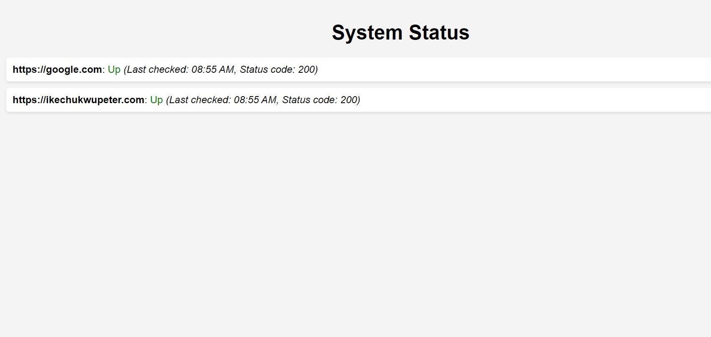

## Downtime

> A simple downtime monitoring tool with nodejs



## Built With 🌩️

- ExpressJs
- NodeJs
- EJS

## Getting Started

To get a local copy up and running follow these simple example steps.

### Prerequisites

Install Node and npm using the `npm install` command on your command line, then install nvm .

### Setup

Clone this repository by typing `git clone https://github.com/ikechukwu-peter/downtime.git` on your terminal.

## Installation

Run

```bash
$ nvm use && npm install
```

## Running the app

```bash
# development
$ npm dev

```

### Usage

Once the app is running, vist localhost:3000.

## **Sponsor** ❤

If you like this project, please give a star ⭐ and/or consider buying me coffee(s). Every donation is appreciated.

  <a href="https://www.buymeacoffee.com/ikechukwupeter">
    
  </a>

## Show your support

Give a ⭐️ if you like this project!

## Author

👤 **Ikechukwu Peter**

- GitHub: [@ikechukwu-peter](https://github.com/ikechukwu-peter)
- Twitter: [@pete_iyke](https://twitter.com/pete_iyke)
- LinkedIn: [LinkedIn](https://www.linkedin.com/in/peter-ikechukwu/)

## 📝 License

This project is [MIT](./LICENSE) licensed.
